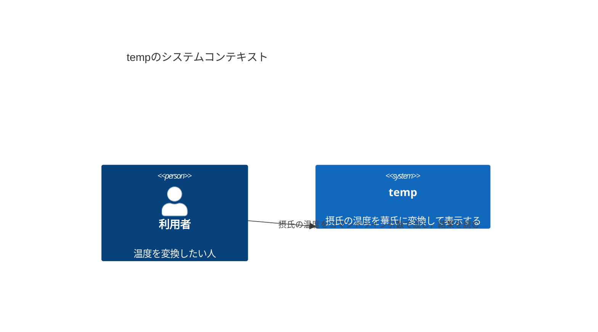
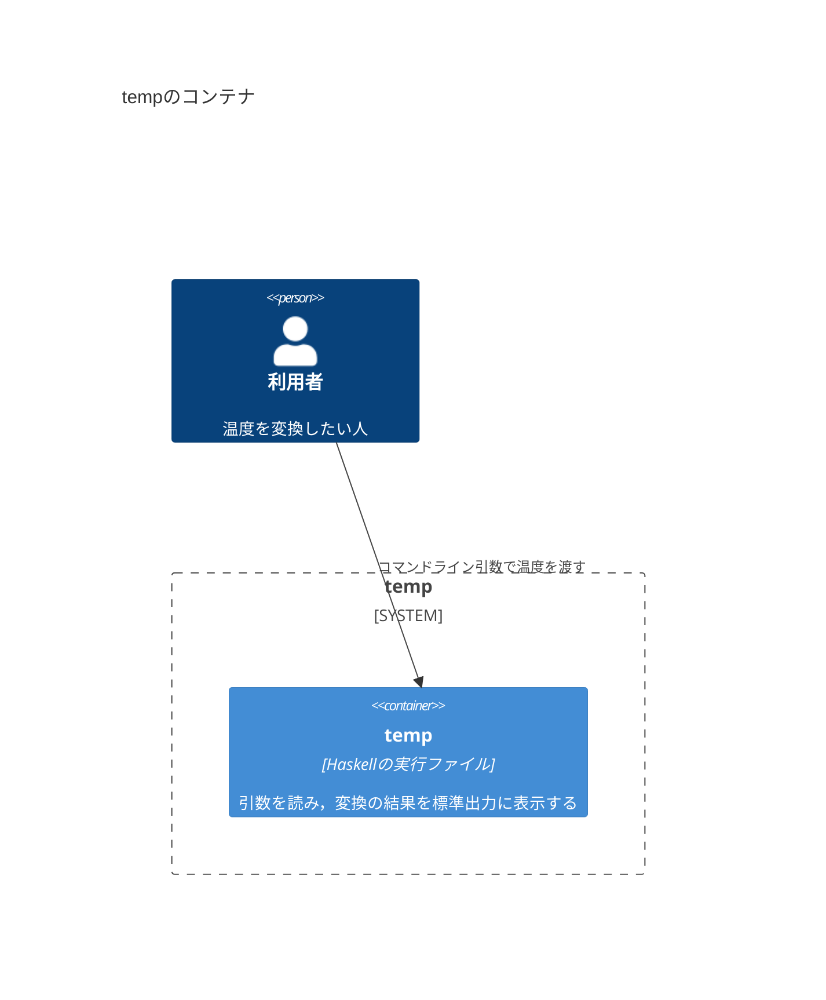
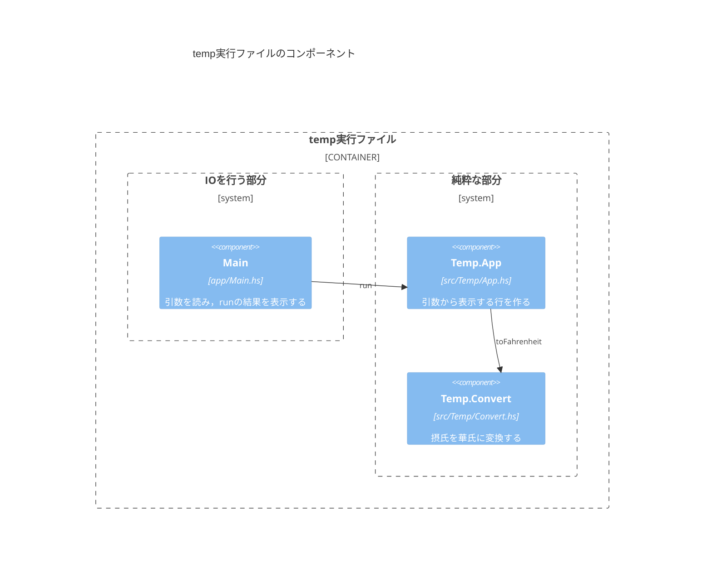
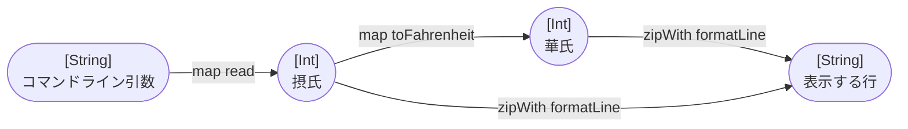
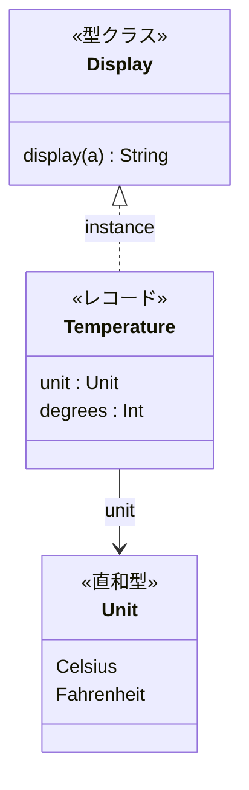
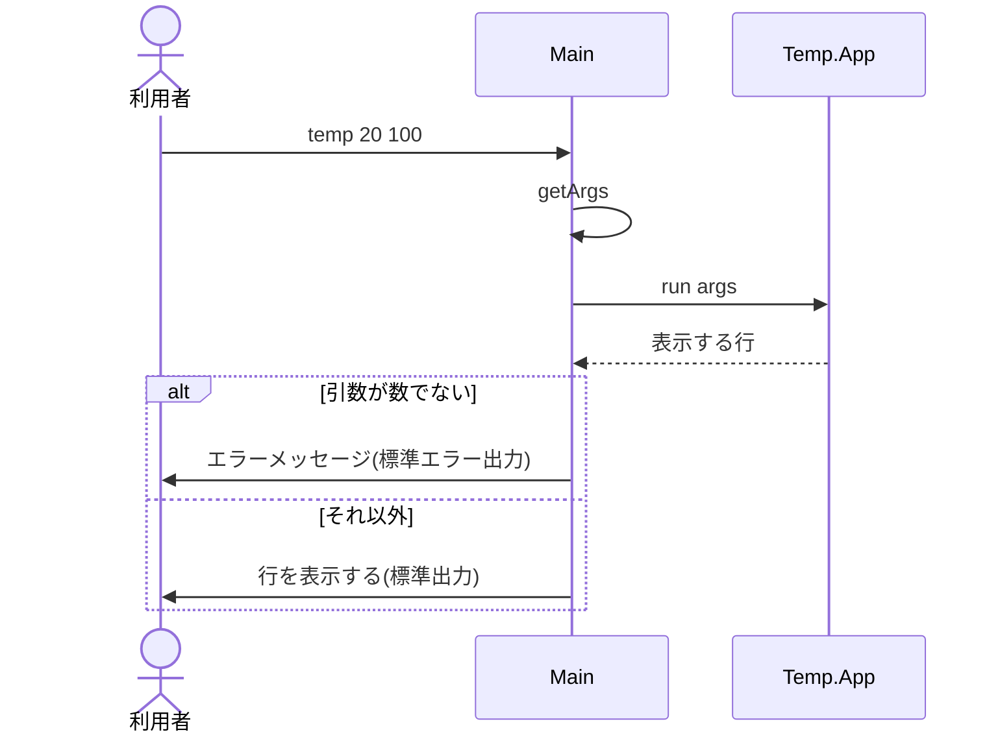
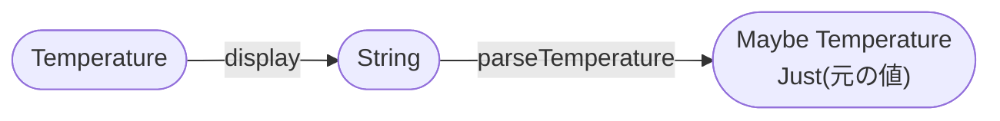

# 設計書の書き方

このハンズオンでは，実装の前に設計書を書き，実装したあとで設計書を見直す．
設計書は，システムの構成をmermaidの図で表したMarkdownのファイルである．
各パッケージの`design/`に置き，Iterationごとに同じ設計書を育てていく．

## 設計と実装のループ

各Iterationは，次の順に進める．

1. **テストリストを書く**：要求を読み，満たすべき振る舞いを単体テストと結合テストのテストリストにする([tdd.md](tdd.md))．
2. **設計書を更新する**：テストリストの振る舞いを実現するために，どの型・関数・モジュールを足したり変えたりするかを決め，設計書の図に描く．
3. **実装する**：テストリストの項目を1つずつRed→Greenにする．設計書に描いた型と関数を作っていく．
4. **設計書を見直す**：実装してみて設計と変わったところがあれば，設計書を実装に合わせて直す．

テストリストは「何ができればよいか(振る舞い)」を，設計書は「それをどんな部品の組み合わせで作るか(構造)」を表す．
設計書の図に描いた関数は，テストリストのどの項目で確かめるのかを，行き来しながら確かめる．

## 設計書の構成

設計書は，[C4モデル](https://c4model.com/)の4つの階層に分け，大まかな図から細かい図へと順に書く．
C4モデルは，ソフトウェアの構成を，地図を拡大するように4段階の粒度で描く方法である．

| ファイル | 階層 | 描くもの | このハンズオンでの中身 |
|---|---|---|---|
| `design/01-context.md` | Context | システムと，それを使う人や外部のシステム | 利用者と`kakeibo`の関係 |
| `design/02-container.md` | Container | システムを構成する，別々に動くもの・データの置き場所 | 実行ファイル，データファイル |
| `design/03-component.md` | Component | 1つのコンテナの中の部品と，その依存関係 | モジュールと，純粋な部分・`IO`を行う部分の境界 |
| `design/04-code.md` | Code | 部品の中身 | 型と関数の流れ，データ型，`IO`の順序 |

C4モデルはオブジェクト指向のシステムを想定して説明されることが多いが，関数型のプログラムにも次のように当てはめられる．

- Componentの部品は，Haskellのモジュールである．
- 関数型の設計では，副作用のない純粋な関数と，`IO`を行う処理を分けることが大切なので，Componentの図では2つを別の境界に入れる．
- Codeの図は，クラスとメソッドの代わりに，型と関数で描く．関数は「ある型の値を別の型の値に変換するもの」なので，型をノード，関数を矢印にした図で，入力から出力までの変換の流れを表す．

### 書くときの決まり

- 図の中の名前(モジュール名・型名・関数名)は，実装の名前と一致させる．
- 1つの図には1つの観点だけを描く．
- 図の上に，何を表す図かを1〜2文で書く．図だけでは伝わらない決めごと(エラーの扱い，並び順など)は，図の下に箇条書きで書く．
- その時点のシステムの姿だけを描く．後のIterationで作るものは描かない．

## 各階層の書き方

例として，摂氏の温度を華氏に変換して表示するコマンド`temp`の設計書を示す．

```console
$ temp 20 100
20℃ = 68℉
100℃ = 212℉
```

### Context(`01-context.md`)

`C4Context`の図で，システムを使う人(`Person`)と，システム(`System`)と，その関係(`Rel`)を描く．



- `Person(名前, "表示名", "説明")`，`System(名前, "表示名", "説明")`．名前は図の中で参照するための英数字の識別子である．
- `Rel(元, 先, "説明")`で関係を矢印にする．
- ほかのシステム(外部のWebサービスなど)とやりとりするときは，`System_Ext`で描く．

### Container(`02-container.md`)

`C4Container`の図で，システムの境界(`System_Boundary`)の中に，別々に動くもの(`Container`)とデータの置き場所(`ContainerDb`)を描く．



- `Container(名前, "表示名", "技術", "説明")`．
- ファイルやデータベースは`ContainerDb(名前, "表示名", "形式", "説明")`で描く．
- コマンドラインのプログラムでは，実行ファイルが1つのコンテナになる．ライブラリのモジュールは実行ファイルの中に組み込まれるので，コンテナではなくComponentの階層で描く．

### Component(`03-component.md`)

`C4Component`の図で，1つのコンテナ(`Container_Boundary`)の中のモジュール(`Component`)と，モジュールの依存関係を描く．
`Boundary`で，`IO`を行うモジュールと純粋なモジュールを分ける．



- `Component(名前, "モジュール名", "ファイル", "役割")`．
- `Rel`の矢印は「使う側から使われる側へ」向け，説明には使う関数の名前を書く．
- どのモジュールがどのモジュールを`import`しているかと，図の矢印を一致させる．

### Code(`04-code.md`)

Codeの階層には，観点の違う図を描く．
型と関数の流れ，データ型，`IO`の順序の3種類を基本とし，プロパティベーステストを書くようになったら(Iteration 8)，満たすべき性質の図を足す．

#### 型と関数の流れ

`flowchart`で，型をノード，関数を矢印にして，入力から出力までの変換を描く．
ノードは`名前(["型"])`(角の丸い箱)で書き，矢印のラベルに関数を書く．



- 矢印は`ノード -- "ラベル" --> ノード`，点線の矢印は`ノード -. "ラベル" .-> ノード`と書く．
- 条件によって別の結果になるときは，それぞれの結果のノードに矢印を引き，ラベルに条件を書く．
- `<br/>`で，ノードの中で改行できる．

#### データ型

`classDiagram`で，自分で定義した型と，型どうしの関係を描く．
`<<…>>`で，型の種類(直和型，レコード，`data`，`newtype`，型クラス)を書く．



- 直和型はデータコンストラクタを，レコードはフィールドを並べる．データコンストラクタが1つでフィールド名のない型(`data YearMonth = YearMonth Int Int`など)は`<<data>>`とし，データコンストラクタの形を書く．
- `A --> B : フィールド名`は「AのフィールドがBの型を持つ」ことを表す．
- `型クラス <|.. 型 : instance`は「型がその型クラスのインスタンスである」ことを表す．`deriving`で作ったインスタンスは，ラベルを`deriving`にする．

#### `IO`の順序

`sequenceDiagram`で，`IO`のアクションがどの順に実行されるかを描く．
純粋な関数の呼び出しも，`IO`との前後関係がわかるように描き入れる．



- `participant 名前 as 表示名`，`actor 名前 as 表示名`で登場するものを並べる．
- `A->>B: 説明`は呼び出し，`A-->>B: 説明`は結果を返すことを表す．
- `alt 条件 … else 条件 … end`で，場合分けを描く．

#### 満たすべき性質

`flowchart`で，関数を組み合わせたときに成り立つべき性質を描く．
変換して逆変換すると元に戻る，のような性質は，行きと帰りの矢印で1つの輪になる．



- 性質が成り立つための前提(値の範囲など)は，図の下に書く．
- 性質は，QuickCheckの`prop`で確かめる．図の性質と，テストの説明の文を一致させる．

## 図を確かめる

- VSCodeでMarkdownのファイルを開き，`Ctrl+Shift+V`(macOSでは`Cmd+Shift+V`)でプレビューを表示すると，図が描かれる．
- `mise run lint`は，すべてのMarkdownのファイルのmermaidの図を，構文として読めるか検査する．コミット時にも，ステージしたMarkdownのファイルが検査される．
- 1つのファイルだけを検査するときは，`node tools/mermaid/check.mjs <ファイル>`を実行する．

mermaidの書き方の詳細は，[mermaidのドキュメント](https://mermaid.js.org/intro/)の各図の節を参照する．
