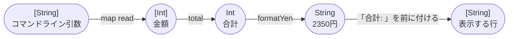
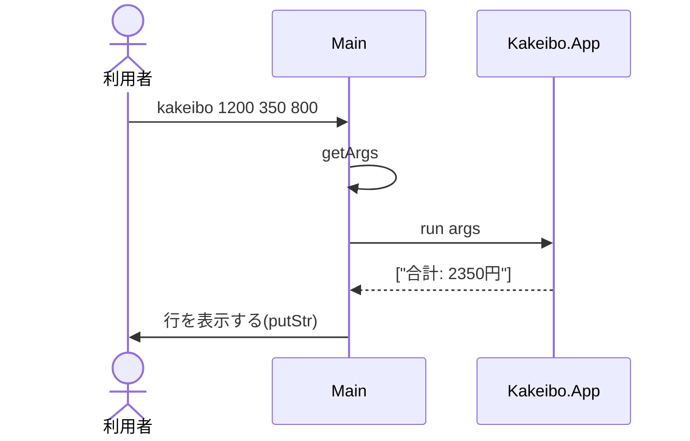

# Code：型と関数

モジュールの中の型と関数を示す．

## 型と関数の流れ

コマンドライン引数から表示する行までを，型の変換の流れで示す．

| モジュール | 関数 | 型 |
|---|---|---|
| `Kakeibo.Money` | `total` | `[Int] -> Int` |
| `Kakeibo.Money` | `formatYen` | `Int -> String` |
| `Kakeibo.App` | `run` | `[String] -> [String]` |

- 引数はすべて整数として読める前提である．

## IOの順序

`main`が実行する`IO`のアクションと，純粋な関数`run`の呼び出しの順序を示す．

