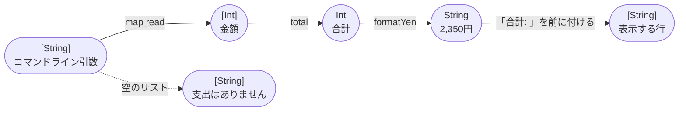
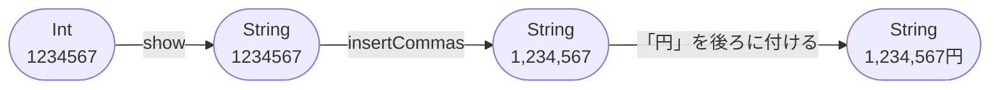
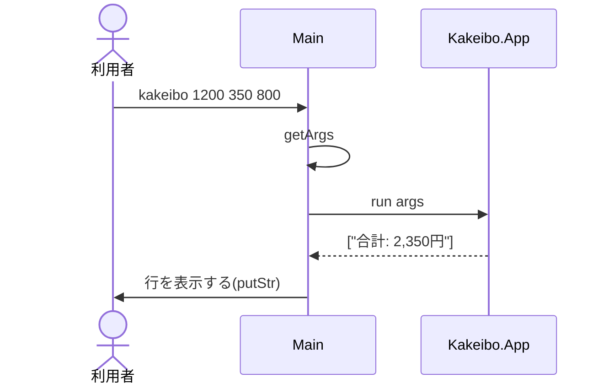

# Code：型と関数

モジュールの中の型と関数を示す．

## 型と関数の流れ

コマンドライン引数から表示する行までを，型の変換の流れで示す．

`formatYen`の中では，金額を数字の並びにしてから，右から3桁ごとにカンマを入れる．

| モジュール | 関数 | 型 | 公開 |
|---|---|---|---|
| `Kakeibo.Money` | `total` | `[Int] -> Int` | する |
| `Kakeibo.Money` | `formatYen` | `Int -> String` | する |
| `Kakeibo.Money` | `insertCommas` | `String -> String` | しない |
| `Kakeibo.App` | `run` | `[String] -> [String]` | する |

- `total`は，空のリストなら0，そうでなければ先頭の金額と残りの合計の和，という再帰で求める．
- `insertCommas`は，3桁以下ならそのまま返し，それより長ければ，右の3桁を除いた部分に再帰でカンマを入れてから，`,`と右の3桁をつなげる．
- 引数はすべて整数として読める前提である．

## IOの順序

`main`が実行する`IO`のアクションと，純粋な関数`run`の呼び出しの順序を示す．

