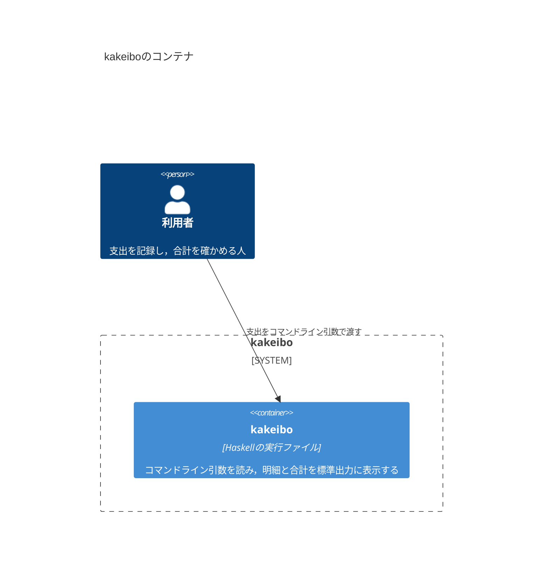

# Container：コンテナ

`kakeibo`を構成する，別々に動くものとデータの置き場所を示す．

```mermaid
C4Container
  title kakeiboのコンテナ
  Person(user, "利用者", "支出を記録し，合計を確かめる人")
  System_Boundary(system, "kakeibo") {
    Container(cli, "kakeibo", "Haskellの実行ファイル", "コマンドライン引数を読み，明細と合計を標準出力に表示する")
  }
  Rel(user, cli, "支出をコマンドライン引数で渡す")
```

- `kakeibo`は，1つの実行ファイルだけでできている．データは保存しない．
