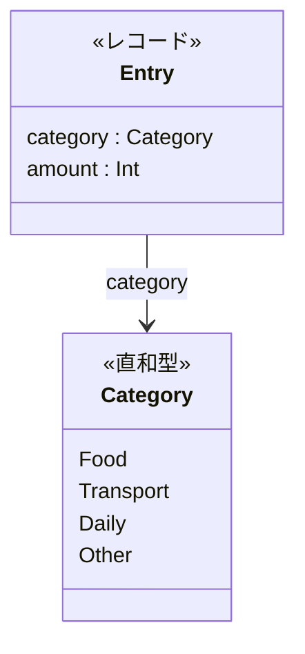
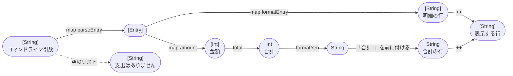
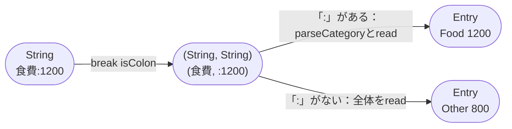
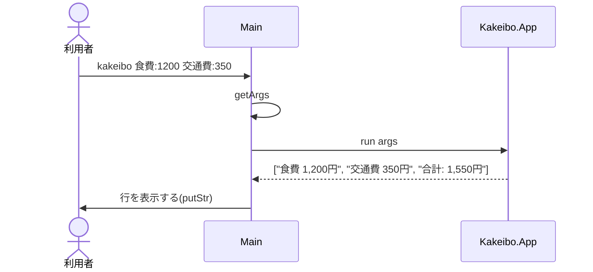

# Code：型と関数

モジュールの中の型と関数を示す．

## データ型

- `Category`と`Entry`は`Kakeibo.Entry`で定義し，`deriving (Show, Eq)`でテストの`shouldBe`で比べられるようにする．

## 型と関数の流れ

コマンドライン引数から表示する行までを，型の変換の流れで示す．

`parseEntry`は，引数を`:`の前と後ろに分け，`:`があるかどうかで場合分けする．

| モジュール | 関数 | 型 | 公開 |
|---|---|---|---|
| `Kakeibo.Money` | `total` | `[Int] -> Int` | する |
| `Kakeibo.Money` | `formatYen` | `Int -> String` | する |
| `Kakeibo.Money` | `insertCommas` | `String -> String` | しない |
| `Kakeibo.Entry` | `parseCategory` | `String -> Category` | する |
| `Kakeibo.Entry` | `categoryName` | `Category -> String` | する |
| `Kakeibo.Entry` | `parseEntry` | `String -> Entry` | する |
| `Kakeibo.Entry` | `formatEntry` | `Entry -> String` | する |
| `Kakeibo.App` | `run` | `[String] -> [String]` | する |

- 知らない費目の名前は「その他」(`Other`)として読む．
- 金額は整数として読める前提である．

## IOの順序

`main`が実行する`IO`のアクションと，純粋な関数`run`の呼び出しの順序を示す．

