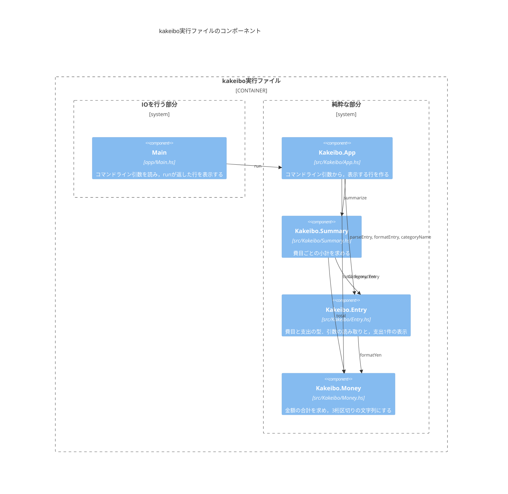

# Component：モジュール

実行ファイル`kakeibo`を構成するモジュールと，その依存関係を示す．

```mermaid
C4Component
  title kakeibo実行ファイルのコンポーネント
  Container_Boundary(cli, "kakeibo実行ファイル") {
    Boundary(io, "IOを行う部分") {
      Component(main, "Main", "app/Main.hs", "コマンドライン引数を読み，runが返した行を表示する")
    }
    Boundary(pure, "純粋な部分") {
      Component(app, "Kakeibo.App", "src/Kakeibo/App.hs", "コマンドライン引数から，表示する行を作る")
      Component(summary, "Kakeibo.Summary", "src/Kakeibo/Summary.hs", "費目ごとの小計を求める")
      Component(entry, "Kakeibo.Entry", "src/Kakeibo/Entry.hs", "費目と支出の型．引数の読み取りと，支出1件の表示")
      Component(money, "Kakeibo.Money", "src/Kakeibo/Money.hs", "金額の合計を求め，3桁区切りの文字列にする")
    }
  }
  Rel(main, app, "run")
  Rel(app, entry, "parseEntry, formatEntry, categoryName")
  Rel(app, summary, "summarize")
  Rel(app, money, "total, formatYen")
  Rel(summary, entry, "Category, Entry")
  Rel(summary, money, "total")
  Rel(entry, money, "formatYen")
```

- `IO`を行うのは`Main`だけである．計算はすべて純粋な関数にし，単体テストと結合テストから直接呼べるようにする．
