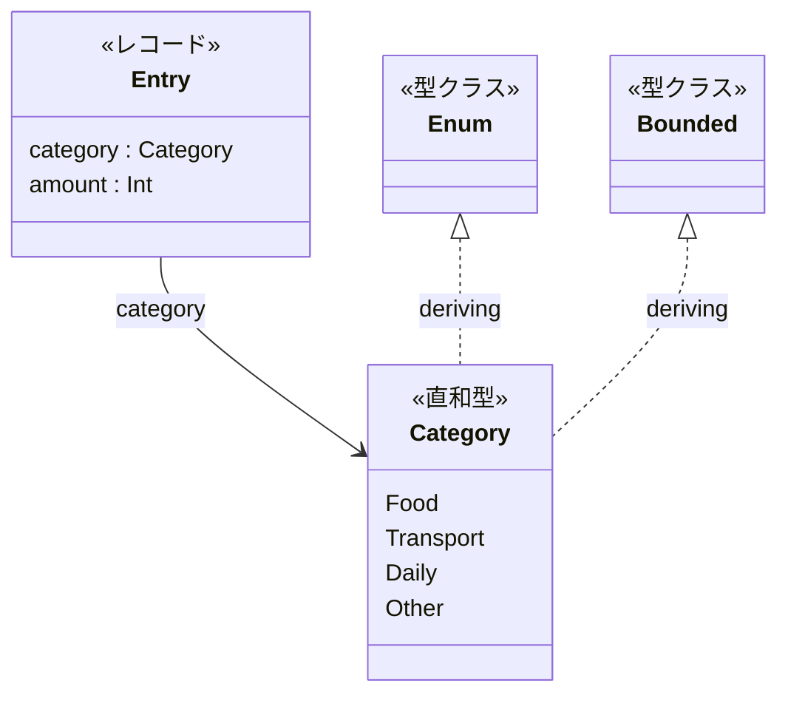
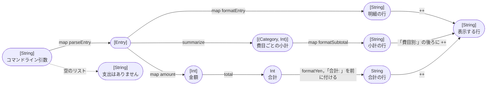
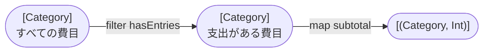
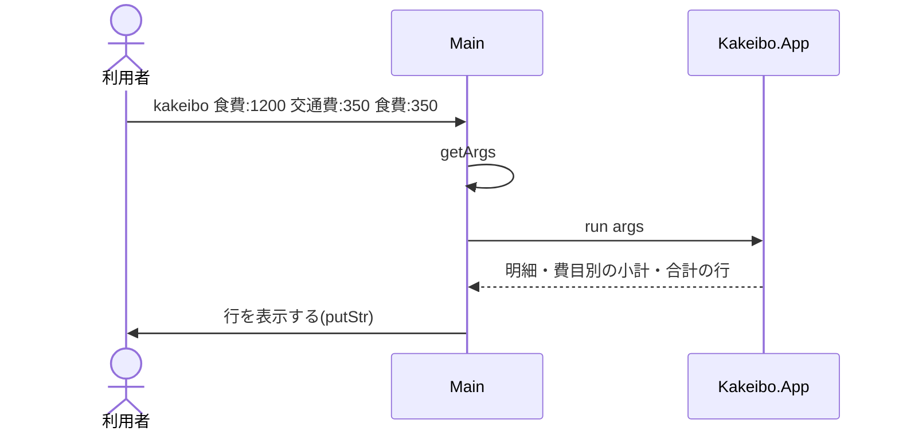

# Code：型と関数

モジュールの中の型と関数を示す．

## データ型

- `Category`と`Entry`は`Kakeibo.Entry`で定義し，`deriving (Show, Eq)`でテストの`shouldBe`で比べられるようにする．
- `Category`は`Enum`と`Bounded`も`deriving`し，`[minBound .. maxBound]`ですべての費目を定義順に並べられるようにする．

## 型と関数の流れ

コマンドライン引数から表示する行までを，型の変換の流れで示す．

`summarize`は，すべての費目のリストから，支出がある費目だけを選び，それぞれの小計を求める．

| モジュール | 関数 | 型 | 公開 |
|---|---|---|---|
| `Kakeibo.Money` | `total` | `[Int] -> Int` | する |
| `Kakeibo.Money` | `formatYen` | `Int -> String` | する |
| `Kakeibo.Money` | `insertCommas` | `String -> String` | しない |
| `Kakeibo.Entry` | `parseCategory` | `String -> Category` | する |
| `Kakeibo.Entry` | `categoryName` | `Category -> String` | する |
| `Kakeibo.Entry` | `parseEntry` | `String -> Entry` | する |
| `Kakeibo.Entry` | `formatEntry` | `Entry -> String` | する |
| `Kakeibo.Summary` | `summarize` | `[Entry] -> [(Category, Int)]` | する |
| `Kakeibo.App` | `run` | `[String] -> [String]` | する |
| `Kakeibo.App` | `formatSubtotal` | `(Category, Int) -> String` | しない |

- `total`は`foldr (+) 0`で求める．
- `allCategories`は`[minBound .. maxBound]`，`entriesOf c`は費目`c`の支出だけのリスト(`filter ((== c) . category)`)である．
- 小計の行は，行頭に空白を2つ入れて`  費目 金額`の形にする．
- 知らない費目の名前は「その他」(`Other`)として読む．金額は整数として読める前提である．

## IOの順序

`main`が実行する`IO`のアクションと，純粋な関数`run`の呼び出しの順序を示す．

