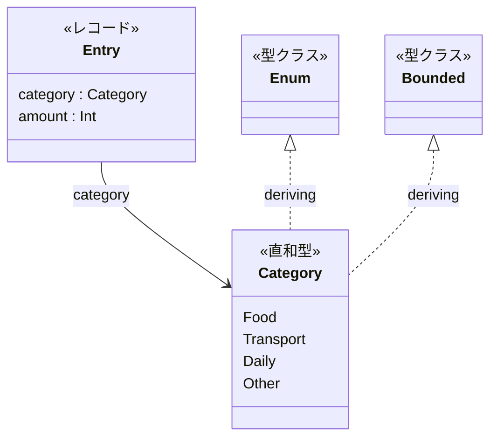
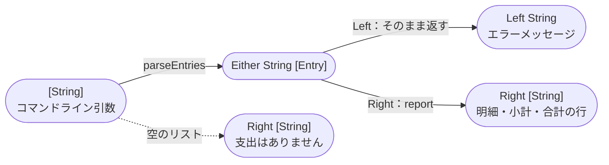
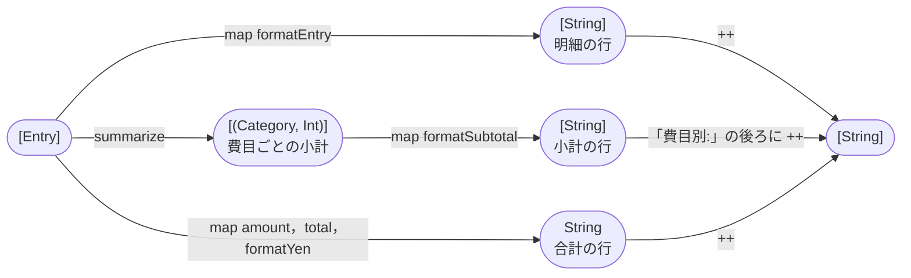
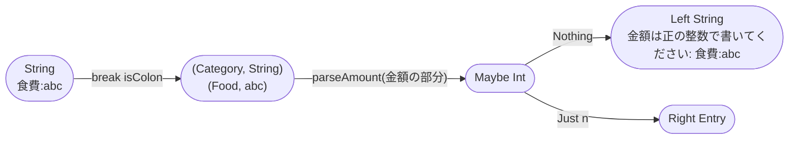
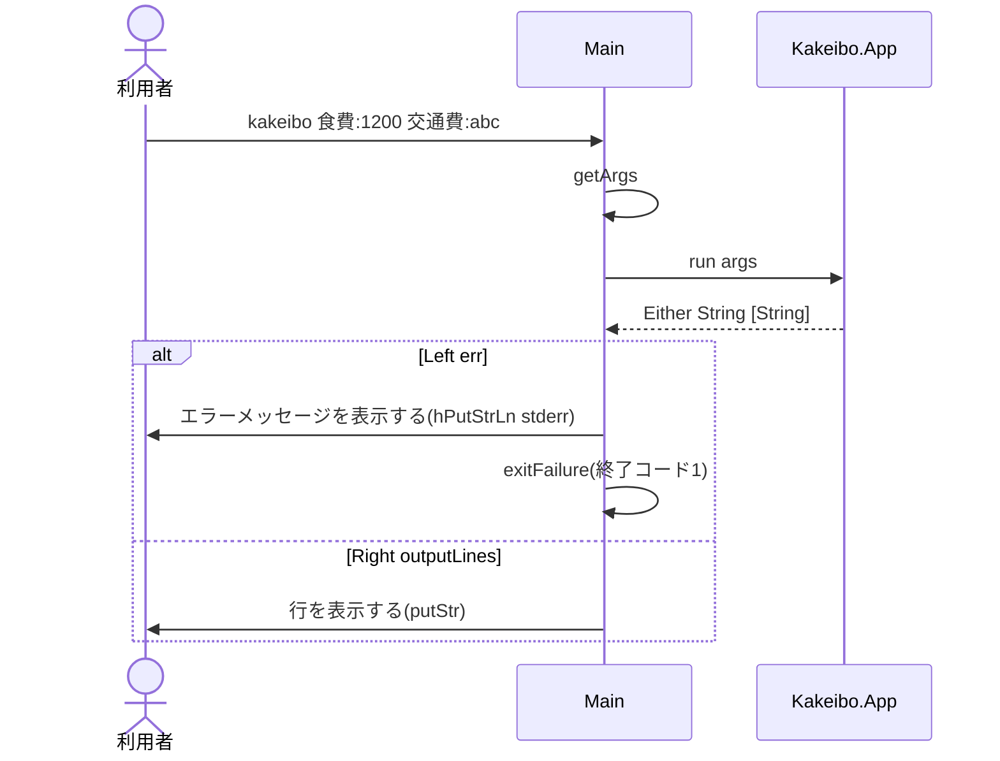

# Code：型と関数

モジュールの中の型と関数を示す．

## データ型

- `Category`と`Entry`は`Kakeibo.Entry`で定義し，`deriving (Show, Eq)`でテストの`shouldBe`で比べられるようにする．
- `Category`は`Enum`と`Bounded`も`deriving`し，`[minBound .. maxBound]`ですべての費目を定義順に並べられるようにする．

## 型と関数の流れ

コマンドライン引数から表示する行までを，型の変換の流れで示す．
失敗しうる変換は`Either String …`を返し，`Left`にエラーメッセージを入れる．

`report`は，支出のリストから明細・小計・合計の行を作る(失敗しない)．

`parseEntries`は，引数を先頭から1つずつ`parseEntry`で読み，最初の`Left`で打ち切る．
`parseEntry`は，金額を`parseAmount`で読み，読めなければ引数を含むエラーメッセージを返す．

| モジュール | 関数 | 型 | 公開 |
|---|---|---|---|
| `Kakeibo.Money` | `total` | `[Int] -> Int` | する |
| `Kakeibo.Money` | `formatYen` | `Int -> String` | する |
| `Kakeibo.Money` | `insertCommas` | `String -> String` | しない |
| `Kakeibo.Entry` | `parseCategory` | `String -> Category` | する |
| `Kakeibo.Entry` | `categoryName` | `Category -> String` | する |
| `Kakeibo.Entry` | `parseAmount` | `String -> Maybe Int` | する |
| `Kakeibo.Entry` | `parseEntry` | `String -> Either String Entry` | する |
| `Kakeibo.Entry` | `parseEntries` | `[String] -> Either String [Entry]` | する |
| `Kakeibo.Entry` | `formatEntry` | `Entry -> String` | する |
| `Kakeibo.Summary` | `summarize` | `[Entry] -> [(Category, Int)]` | する |
| `Kakeibo.App` | `run` | `[String] -> Either String [String]` | する |
| `Kakeibo.App` | `report` | `[Entry] -> [String]` | しない |
| `Kakeibo.App` | `formatSubtotal` | `(Category, Int) -> String` | しない |

- 金額は正の整数でなければならない．`parseAmount`は`readMaybe`で読み，1以上のときだけ`Just`を返す．
- 誤った引数が複数あれば，最初のもののエラーメッセージを返す．
- 知らない費目の名前は「その他」(`Other`)として読む．

## IOの順序

`main`が実行する`IO`のアクションと，純粋な関数`run`の呼び出しの順序を示す．

