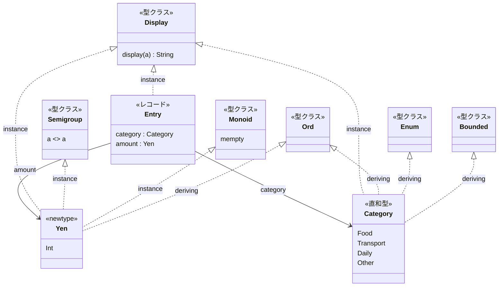
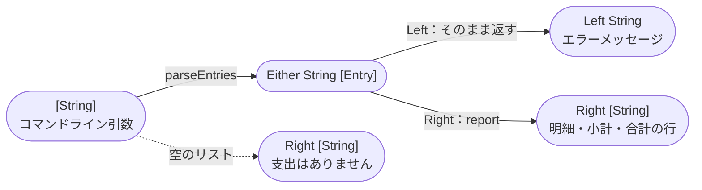
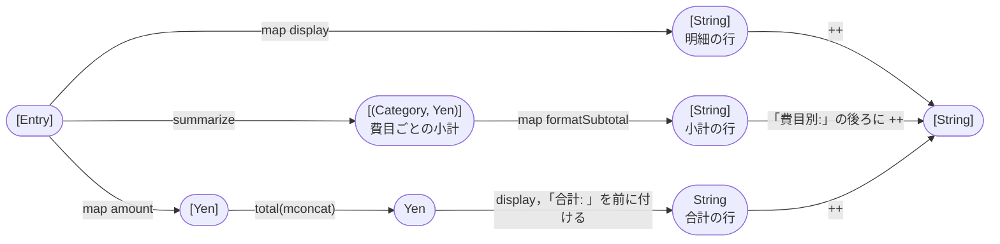
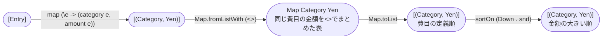
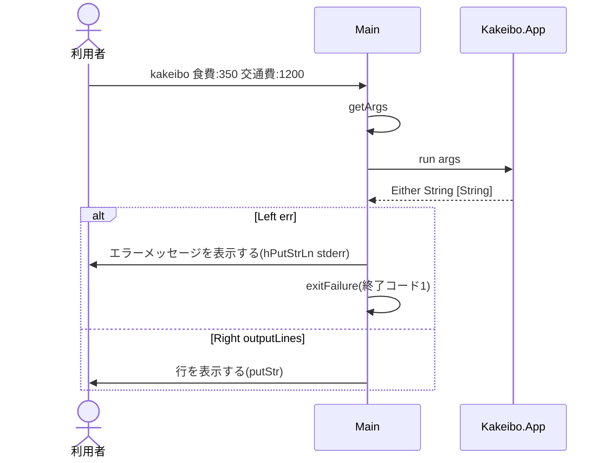

# Code：型と関数

モジュールの中の型と関数を示す．

## データ型

| 型 | インスタンス | 定義 |
|---|---|---|
| `Yen` | `Semigroup` | `Yen a <> Yen b = Yen (a + b)` |
| `Yen` | `Monoid` | `mempty = Yen 0` |
| `Yen` | `Display` | 3桁区切りの数の後ろに「円」を付ける(`1,200円`) |
| `Category` | `Display` | 費目の名前(`食費`など) |
| `Entry` | `Display` | `費目 金額`(`食費 1,200円`) |

- `Yen`と`Category`は`Ord`を`deriving`する．`Yen`は中の数の大小，`Category`は定義の順で比べる．

## 型と関数の流れ

コマンドライン引数から表示する行までを，型の変換の流れで示す．
失敗しうる変換は`Either String …`を返し，`Left`にエラーメッセージを入れる．

`report`は，支出のリストから明細・小計・合計の行を作る(失敗しない)．

`summarize`は，費目をキー，金額を値にした表を作り，金額の大きい順に並べる．

| モジュール | 関数 | 型 | 公開 |
|---|---|---|---|
| `Kakeibo.Display` | `display` | `Display a => a -> String` | する |
| `Kakeibo.Money` | `total` | `[Yen] -> Yen` | する |
| `Kakeibo.Money` | `insertCommas` | `String -> String` | しない |
| `Kakeibo.Entry` | `parseCategory` | `String -> Category` | する |
| `Kakeibo.Entry` | `parseAmount` | `String -> Maybe Yen` | する |
| `Kakeibo.Entry` | `parseEntry` | `String -> Either String Entry` | する |
| `Kakeibo.Entry` | `parseEntries` | `[String] -> Either String [Entry]` | する |
| `Kakeibo.Summary` | `summarize` | `[Entry] -> [(Category, Yen)]` | する |
| `Kakeibo.App` | `run` | `[String] -> Either String [String]` | する |
| `Kakeibo.App` | `report` | `[Entry] -> [String]` | しない |
| `Kakeibo.App` | `formatSubtotal` | `(Category, Yen) -> String` | しない |

- 小計が同じ費目どうしは，費目の定義順に並べる．`sortOn`は基準が同じ要素の順番を保ち，`Map.toList`は定義順に並べるので，この順になる．
- 金額は正の整数でなければならない．誤った引数が複数あれば，最初のもののエラーメッセージを返す．

## IOの順序

`main`が実行する`IO`のアクションと，純粋な関数`run`の呼び出しの順序を示す．

