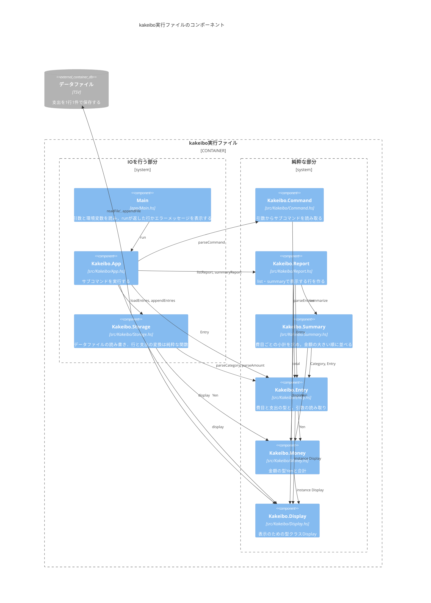

# Component：モジュール

実行ファイル`kakeibo`を構成するモジュールと，その依存関係を示す．

- `IO`を行うのは`Main`，`Kakeibo.App`の`run`，`Kakeibo.Storage`の`loadEntries`と`appendEntries`である．
- 引数の読み取り，データファイルの行の変換(`encodeEntry`・`decodeEntry`・`decodeEntries`)，表示する行の組み立ては，すべて純粋な関数にし，単体テストで確かめる．
- `IO`の関数は，「読む」「純粋な関数に渡す」「書く」をつなぐだけにし，結合テストで確かめる．
- `Kakeibo.Summary`は`Data.Map.Strict`(`containers`パッケージ)を，`Kakeibo.Storage`は`System.Directory`(`directory`パッケージ)を使う．
