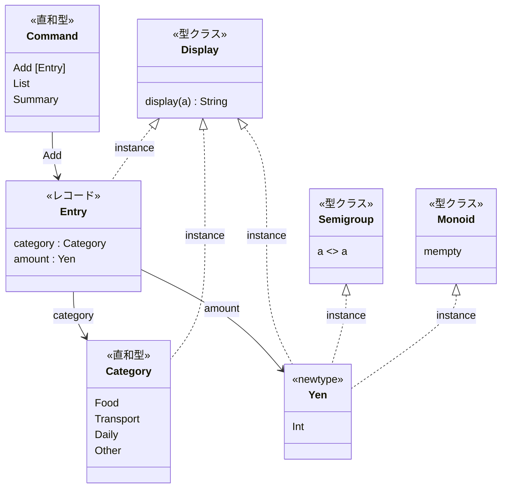
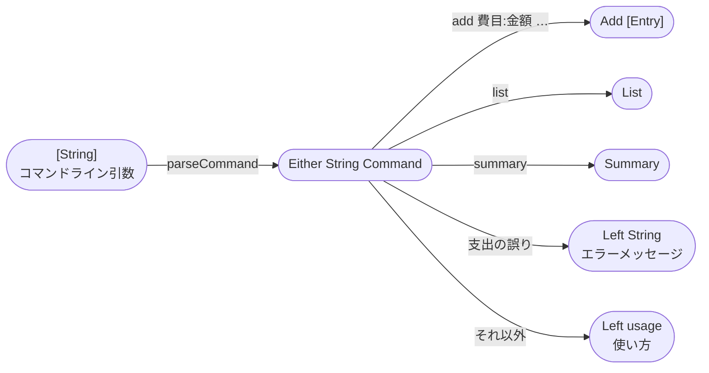
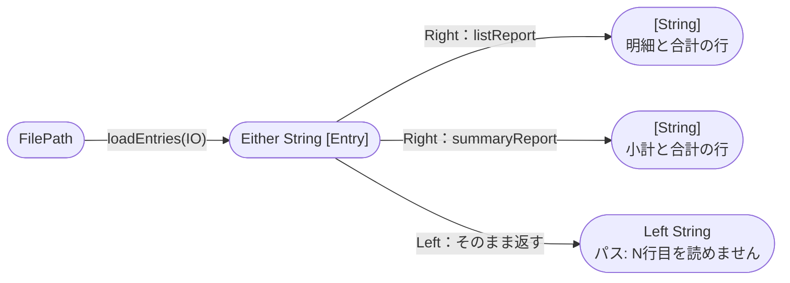
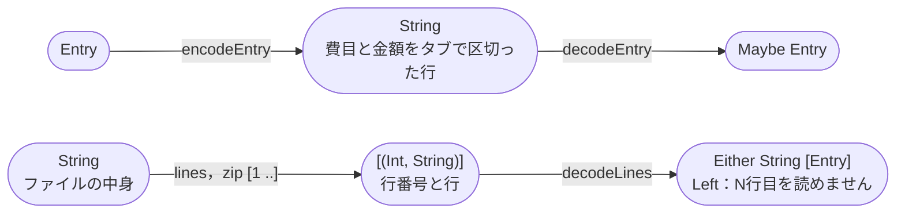
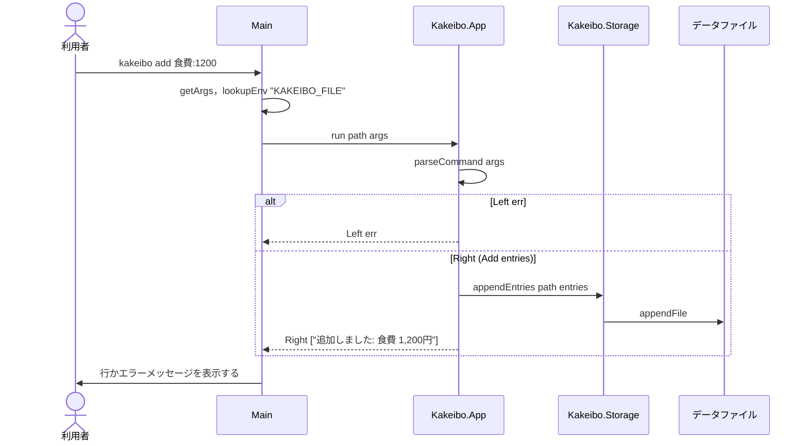
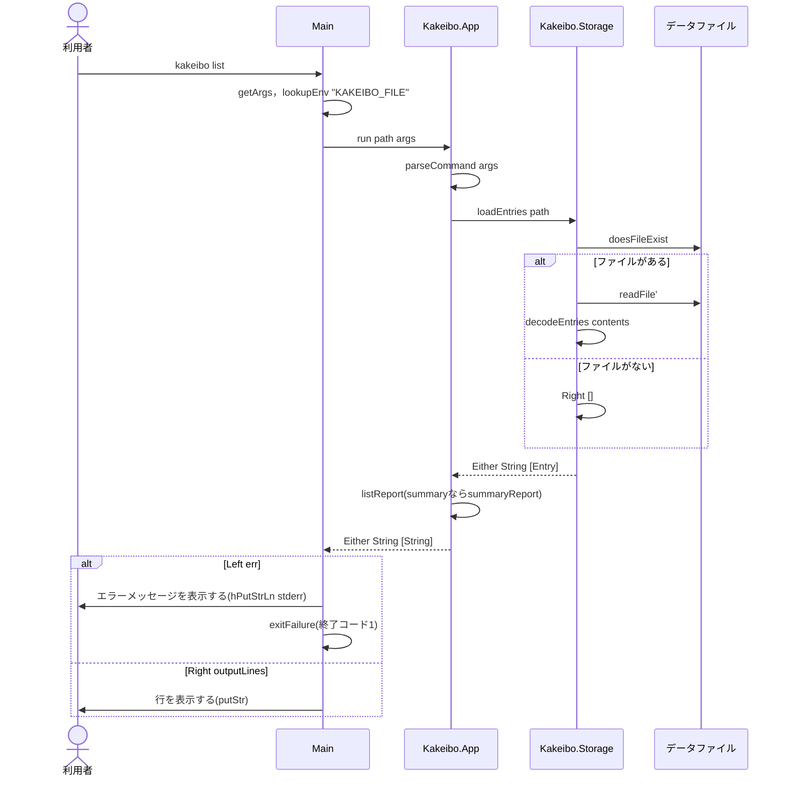

# Code：型と関数

モジュールの中の型と関数を示す．

## データ型

- `Yen`の`<>`は足し算，`mempty`は0円である．
- `Yen`と`Category`は`Ord`を，`Category`は`Enum`と`Bounded`を`deriving`する．

## 型と関数の流れ

### サブコマンドの読み取り

### list・summary

### データファイルの行と支出の変換

| モジュール | 関数 | 型 | 公開 |
|---|---|---|---|
| `Kakeibo.Command` | `parseCommand` | `[String] -> Either String Command` | する |
| `Kakeibo.Command` | `usage` | `String` | する |
| `Kakeibo.Report` | `listReport` | `[Entry] -> [String]` | する |
| `Kakeibo.Report` | `summaryReport` | `[Entry] -> [String]` | する |
| `Kakeibo.Storage` | `encodeEntry` | `Entry -> String` | する |
| `Kakeibo.Storage` | `decodeEntry` | `String -> Maybe Entry` | する |
| `Kakeibo.Storage` | `decodeEntries` | `String -> Either String [Entry]` | する |
| `Kakeibo.Storage` | `loadEntries` | `FilePath -> IO (Either String [Entry])` | する |
| `Kakeibo.Storage` | `appendEntries` | `FilePath -> [Entry] -> IO ()` | する |
| `Kakeibo.App` | `run` | `FilePath -> [String] -> IO (Either String [String])` | する |
| `Kakeibo.App` | `defaultDataFile` | `FilePath` | する |
| `Kakeibo.Summary` | `summarize` | `[Entry] -> [(Category, Yen)]` | する |
| `Kakeibo.Entry` | `parseCategory` | `String -> Category` | する |
| `Kakeibo.Entry` | `parseAmount` | `String -> Maybe Yen` | する |
| `Kakeibo.Entry` | `parseEntry` | `String -> Either String Entry` | する |
| `Kakeibo.Entry` | `parseEntries` | `[String] -> Either String [Entry]` | する |
| `Kakeibo.Money` | `total` | `[Yen] -> Yen` | する |

- `list`・`summary`は，支出が1件もなければ`支出はありません`を表示する．
- `add`の支出に1つでも誤りがあれば，何も追記しない．`parseCommand`がすべての支出を読み終えてから`Add`を返し，`appendEntries`はその後でだけ呼ぶ．

## IOの順序

### add

### list・summary

