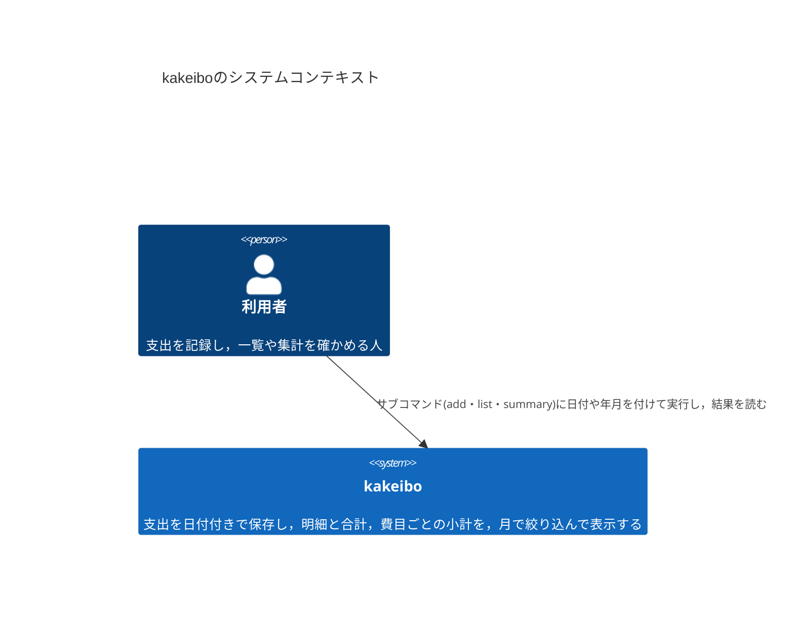

# Context：システムコンテキスト

`kakeibo`を使う人と，`kakeibo`の関係を示す．

```mermaid
C4Context
  title kakeiboのシステムコンテキスト
  Person(user, "利用者", "支出を記録し，一覧や集計を確かめる人")
  System(kakeibo, "kakeibo", "支出を日付付きで保存し，明細と合計，費目ごとの小計を，月で絞り込んで表示する")
  Rel(user, kakeibo, "サブコマンド(add・list・summary)に日付や年月を付けて実行し，結果を読む")
```
