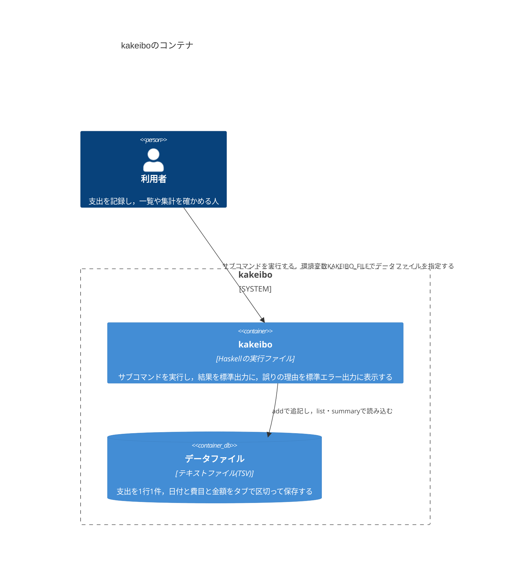

# Container：コンテナ

`kakeibo`を構成する，別々に動くものとデータの置き場所を示す．

```mermaid
C4Container
  title kakeiboのコンテナ
  Person(user, "利用者", "支出を記録し，一覧や集計を確かめる人")
  System_Boundary(system, "kakeibo") {
    Container(cli, "kakeibo", "Haskellの実行ファイル", "サブコマンドを実行し，結果を標準出力に，誤りの理由を標準エラー出力に表示する")
    ContainerDb(file, "データファイル", "テキストファイル(TSV)", "支出を1行1件，日付と費目と金額をタブで区切って保存する")
  }
  Rel(user, cli, "サブコマンドを実行する．環境変数KAKEIBO_FILEでデータファイルを指定する")
  Rel(cli, file, "addで追記し，list・summaryで読み込む")
```

- データファイルのパスは，環境変数`KAKEIBO_FILE`で指定する．指定がなければ，実行した場所の`kakeibo.tsv`を使う．
- データファイルがまだなければ，支出が0件として扱う．
