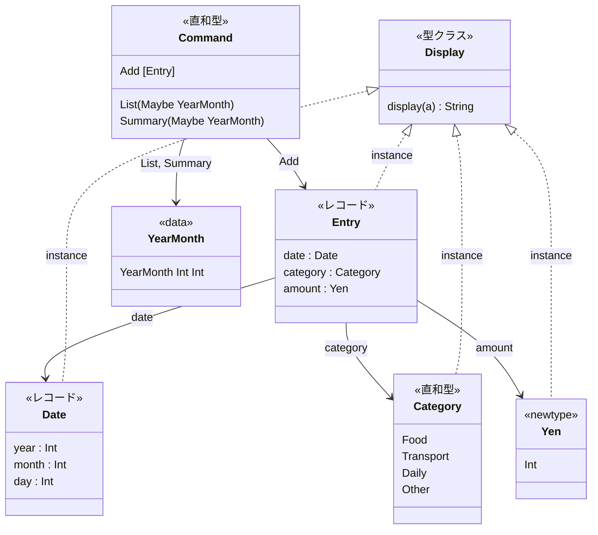
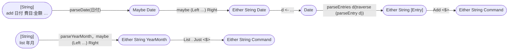
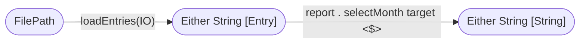
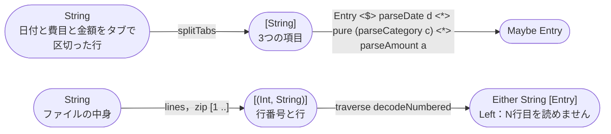
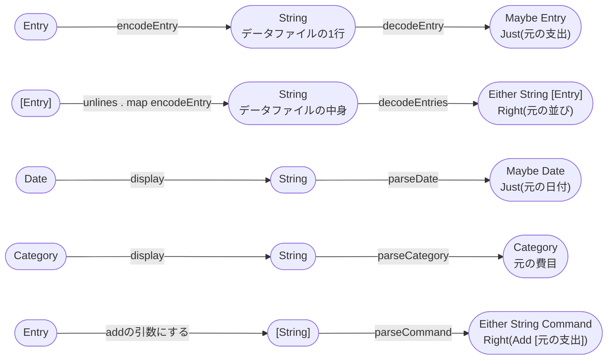
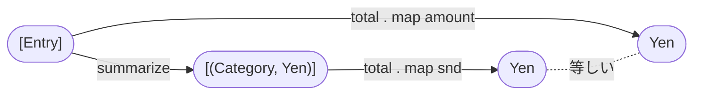
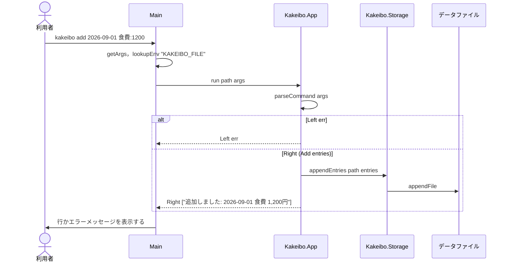
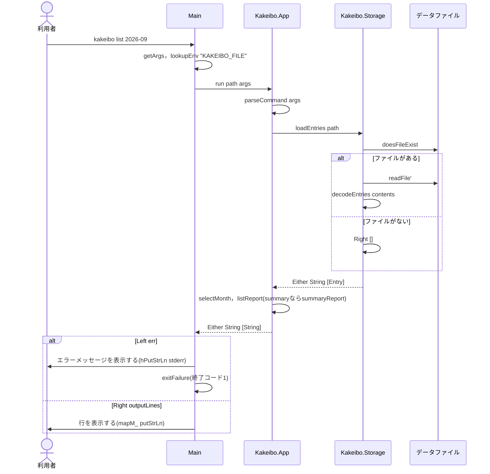

# Code：型と関数

モジュールの中の型と関数を示す．

## データ型

- `Date`は`Ord`を`deriving`し，年・月・日の順に比べる．`Display`では`2026-09-01`のように月と日を2桁で表示する．
- `Yen`は`Semigroup`(`<>`は足し算)と`Monoid`(`mempty`は0円)のインスタンスである．
- `Yen`と`Category`は`Ord`を，`Category`は`Enum`と`Bounded`を`deriving`する．

## 型と関数の流れ

`Maybe`・`Either`を返す関数どうしは，`<$>`・`<*>`・`do`記法・`traverse`で組み合わせる．

### サブコマンドの読み取り

`add`は，日付を読んでから，その日付で支出を読む．前の結果を使うので，`Either`の`do`記法で書く．

### list・summary

- `selectMonth`は，年月の指定(`Maybe YearMonth`)が`Nothing`ならすべての支出を，`Just ym`なら`inMonth ym . date`を満たす支出だけを選ぶ．
- `report`は，`list`なら`listReport`，`summary`なら`summaryReport`である．

### データファイルの行と支出の変換

日付・費目・金額は互いに関係なく読めるので，`<$>`と`<*>`で組み合わせる．

| モジュール | 関数 | 型 | 公開 |
|---|---|---|---|
| `Kakeibo.Date` | `parseDate` | `String -> Maybe Date` | する |
| `Kakeibo.Date` | `parseYearMonth` | `String -> Maybe YearMonth` | する |
| `Kakeibo.Date` | `inMonth` | `YearMonth -> Date -> Bool` | する |
| `Kakeibo.Date` | `daysInMonth` | `Int -> Int -> Int` | しない |
| `Kakeibo.Date` | `isLeapYear` | `Int -> Bool` | しない |
| `Kakeibo.Command` | `parseCommand` | `[String] -> Either String Command` | する |
| `Kakeibo.Command` | `usage` | `String` | する |
| `Kakeibo.Report` | `listReport` | `[Entry] -> [String]` | する |
| `Kakeibo.Report` | `summaryReport` | `[Entry] -> [String]` | する |
| `Kakeibo.Storage` | `encodeEntry` | `Entry -> String` | する |
| `Kakeibo.Storage` | `decodeEntry` | `String -> Maybe Entry` | する |
| `Kakeibo.Storage` | `decodeEntries` | `String -> Either String [Entry]` | する |
| `Kakeibo.Storage` | `loadEntries` | `FilePath -> IO (Either String [Entry])` | する |
| `Kakeibo.Storage` | `appendEntries` | `FilePath -> [Entry] -> IO ()` | する |
| `Kakeibo.App` | `run` | `FilePath -> [String] -> IO (Either String [String])` | する |
| `Kakeibo.App` | `selectMonth` | `Maybe YearMonth -> [Entry] -> [Entry]` | しない |
| `Kakeibo.Summary` | `summarize` | `[Entry] -> [(Category, Yen)]` | する |
| `Kakeibo.Entry` | `parseAmount` | `String -> Maybe Yen` | する |
| `Kakeibo.Entry` | `parseEntry` | `Date -> String -> Either String Entry` | する |
| `Kakeibo.Entry` | `parseEntries` | `Date -> [String] -> Either String [Entry]` | する |

- 日付は`YYYY-MM-DD`の形で，存在する日付でなければならない(うるう年を考える)．年月は`YYYY-MM`の形である．
- `add`の支出に1つでも誤りがあれば，何も追記しない．

## 満たすべき性質

関数を組み合わせたときに，どんな入力でも成り立つべき性質を示す．
どの性質も，QuickCheckの`prop`で確かめる．

### 変換して逆変換すると元に戻る

### 集計しても全体の量は変わらない

- `summarize`の結果には，同じ費目が1度しか現れず，小計は大きい順に並ぶ．
- `Yen`の`<>`は結合法則を満たし，`mempty`は`<>`の単位元である．`total`は中の数の和になる．
- `add`した支出の合計は，`list`の最後の行に表示される(結合テスト)．

### 性質の前提

性質は，要求で正しいとされる値についてだけ成り立つ．
テスト用のジェネレータ(`test/common/Kakeibo/Generators.hs`)は，次の値だけを作る．

| ジェネレータ | 作る値 |
|---|---|
| `genCategory` | すべての費目のどれか |
| `genYen` | 1円から1,000万円までの金額 |
| `genDate` | 2000年から2099年までの，1日から28日までの日付(どの月にも存在する) |
| `genEntry` | 上の3つを組み合わせた支出 |

## IOの順序

### add

### list・summary

